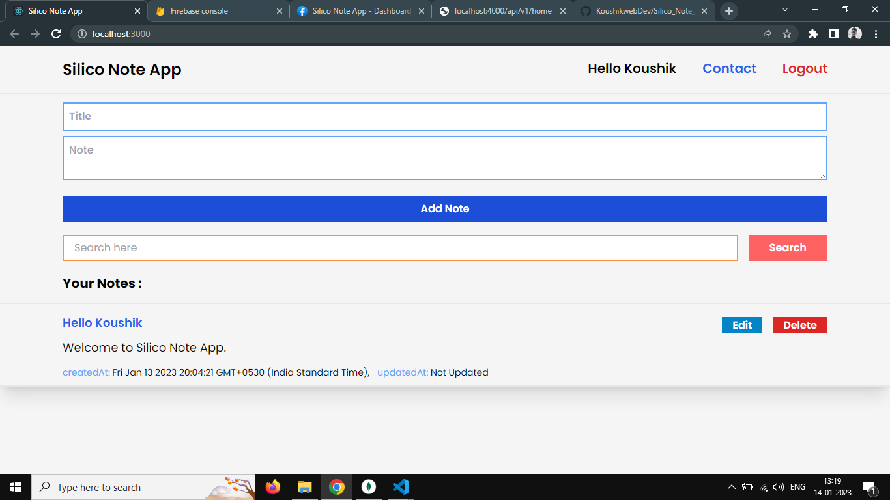
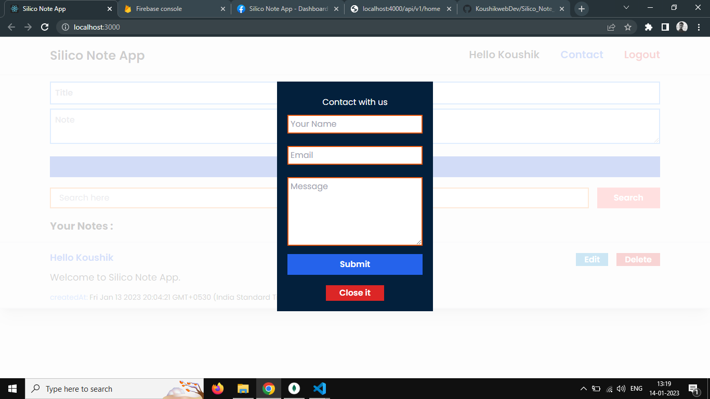
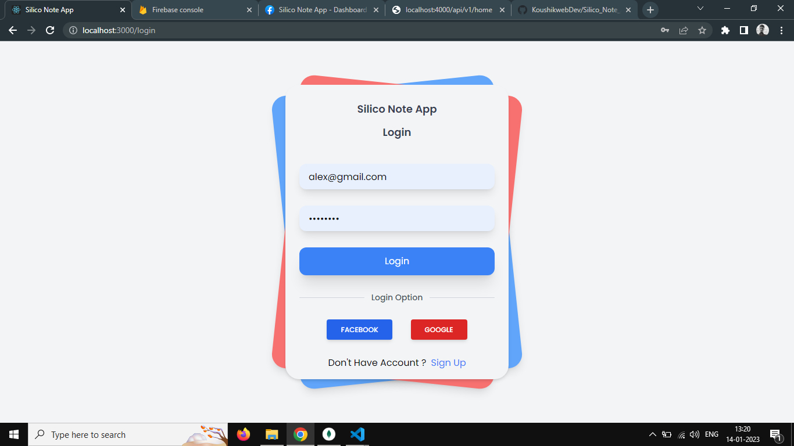
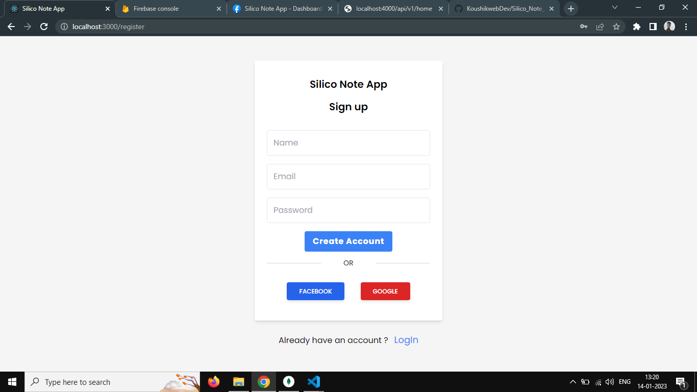

# **Silico Note App**

### My Internship Project

**It is a Note taking App with Authentication System. MERN technology used here.**

## Author

- [@Koushik Saha](https://www.github.com/koushikwebdev)

## Live

### **[Silico Note App](https://siliconote.up.railway.app/register)**

## Tech Stack

**Client:** React, TailwindCSS, Firebase

**Server:** Node, Express, MongoDB

## Features

- Login and Logout
- Social Login
- Fullscreen mode
- Mobile Responsive
- Add Note, Delete Note, Update Note, Read Note
- contact with team

## App Screenshots






## Deployment

To deploy backend and frontend project run

```bash
  npm start
```
